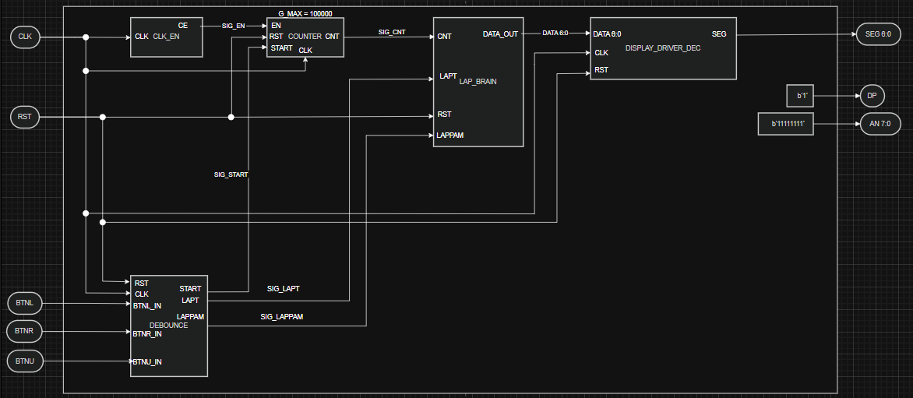

# Projekt StopWatch
Jedná se o stopky, které na displeji zobrazují aktuální čas, s možností přepnutí na zobrazení uloženého času v paměti.

## Spolupracovali:

* Truong Hong Minh
* Vocilka Jiří
* Tvarůžek Tomáš

### Vstupy
* Start/Stop - spuštění stopky, zastavení stopek
* RST - úplné vynulování 
* Lap_sv - uložení aktuálního času
* Lap_sw - přepínání mezi zobrazením stopek a uložených časů

### Výstupy
- zobrazení aktuálního času stopek
- zobrazení uloženého času

### Blokový diagram

