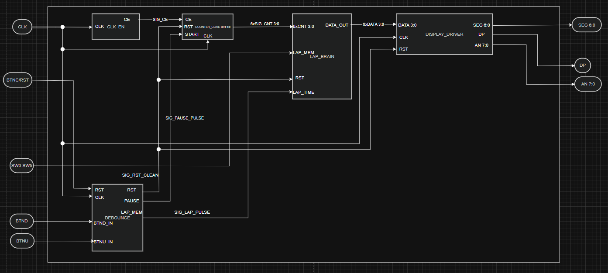
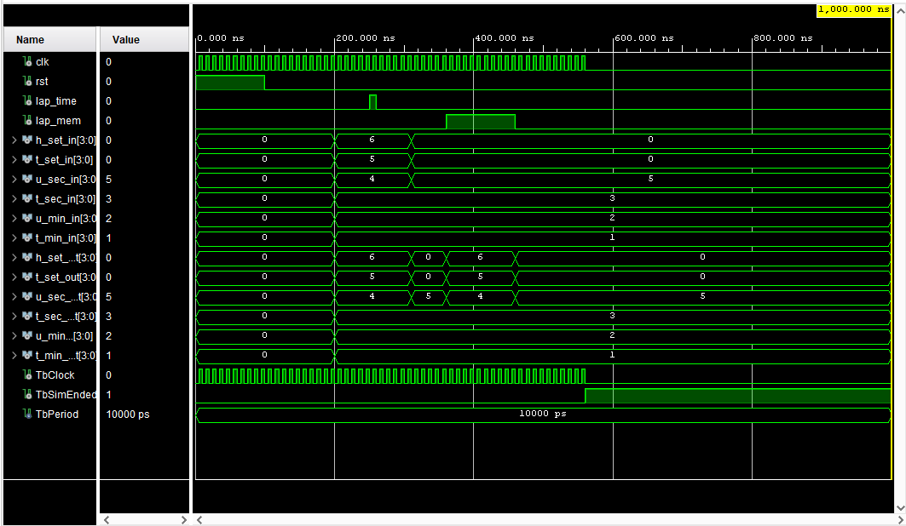
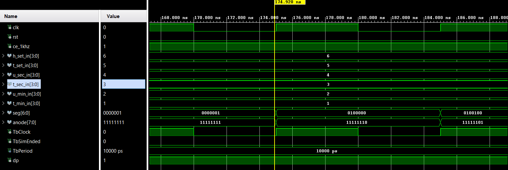

# Projekt StopWatch
Jedná se o stopky, které na displeji zobrazují aktuální čas, s možností  uložení času a následného přepnutí na zobrazení tohoto uloženého času.

## Spolupracovali:

* Truong Hong Minh
* Vocilka Jiří
* Tvarůžek Tomáš

### Vstupy
* BTND (Start/Stop) - spuštění nebo zastavení stopek
* BTNC - úplné vynulování 
* BTNU - uložení aktuálního času
* SW[0] - přepínání mezi zobrazením aktuálního času a uloženým časem

### Výstupy
- zobrazení aktuálního času stopek
- zobrazení uloženého času

### Blokový diagram

### Testbench pro Counter_core

### Testbench pro Lap_brain

### Testbench pro Display_driver

