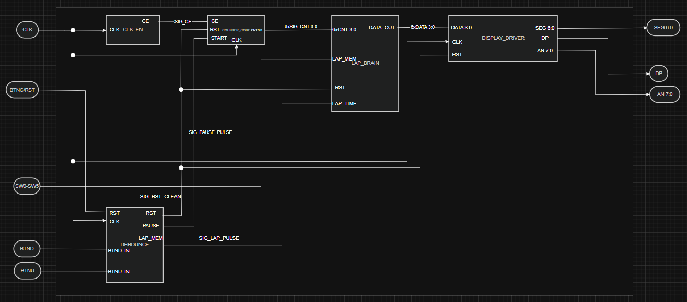
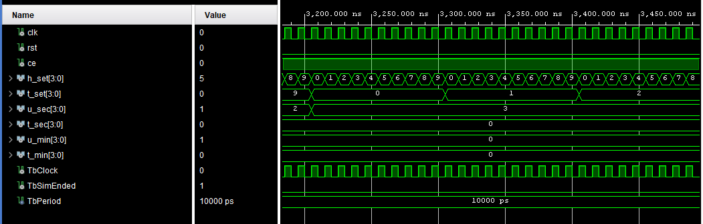
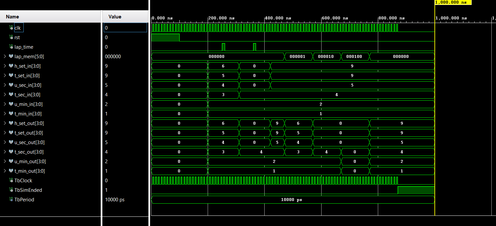
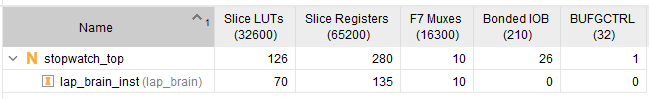

# Projekt StopWatch
Jedná se o stopky, které na displeji zobrazují aktuální čas s možností uložení a následného zobrazení  šesti mezičasů.

## Video demonstrace funkčnosti: 
[StopWatchVideo](https://youtu.be/KcD7gJXMx3k)

## Plakát ke stažení:

[StopWatch Plakát A3](Plakát%20Stopwatch.pdf?raw=true)

## Spolupracovali:

* Truong Hong Minh
* Vocilka Jiří
* Tvarůžek Tomáš

### Vstupy
* BTND - spuštění nebo zastavení stopek (Start/Stop)
* BTNC - úplné vynulování (Reset)
* BTNU - uložení aktuálního času
* SW[5:0] - přepínání mezi zobrazením aktuálního času a uloženým časem

### Výstupy
- zobrazení aktuálního času stopek
- zobrazení uložených časů

### Použitý Hardware a Software

Projekt je navržen pro vývojovou desku **Nexys A7-50T**.

* Vývojová deska: Digilent Nexys A7-50T (FPGA Artix-7)
* Vývojové prostředí: Xilinx Vivado
* Jazyk popisu hardwaru: VHDL

---

### Blokový diagram

### Použité moduly ze cvičení: [Debounce](StopWatchDE1.srcs/sources_1/debounce.vhd), [Counter](StopWatchDE1.srcs/sources_1/counter.vhd), [Clk_en](StopWatchDE1.srcs/sources_1/clk_en.vhd), [Bin2seg](StopWatchDE1.srcs/sources_1/bin2seg.vhd)

## Popisy vlastních bloků:

--- 

### 1. Counter_core - ([Counter_core](StopWatchDE1.srcs/sources_1/counter_core.vhd))

--- 

Využívá 6 kaskádově zapojených čítačů counter vytvořených v rámci cvičení, které čítají od 0 po 9 s výjimkou čítače desítek minut, který je pouze od 0 do 5. V momentě kdy čítač dosáhne 9 pošle enable signál na další counter v kaskádě, který se zvýší o 1. Výstupní signál tedy tvoří šest 4bitových signálů.

#### Counter_core testbench

Na obrázku je vidět simulace bloku, kde můžeme vidět počítání jednotlivých counterů. Pro setiny (h_set)je vidět, že pokaždé když dojdou do 9 zvýší se následující counter na desítky setin (t_set) o 1. Dále je na začátku grafu vidět, že v moment kdy tento counter dojde do 9 opět se counter následující (u_sec) zvedne o 1. 
 
---

### 2. Lap Brain - ([Lap_brain](StopWatchDE1.srcs/sources_1/lap_brain.vhd))

---

Tento blok přijímá signál z bloku counter_core a rozhoduje zda do následujícího bloku display_driver poslat aktuální čas nebo některý z uložených časů. Čas se uloží při stisknutí tlačítka do první paměti sw[0] a postupně se zvyšuje až na sw[5]. K dispozici je tedy 6 pamětí a v případě uložení dalšího mezičasu se opět přepíše první paměť sw[0].

#### Lap_Brain testbench

V simulaci vidíme manuální simulaci běžících stopek (časy 12:34:56, 12:40:00 a 12:45:99) v řádcích h_set_in až t_min_in. V řádku lap_time vidíme, že bylo 2x stisknuto tlačítko na uložení mezičasu. Řádek lap_mem poté udává, jestli zobrazujeme živý čas nebo uložený mezičas. Při aktivování první paměti (000001) můžeme ve výstupních hodnotách h_set_out až t_min_out vidět opět čas 12:34:56, i když stopky už jsou na čase 12:45:99. Při aktivaci druhého switche vidíme čas 12:40:00 a při aktivaci třetího, kam jsme zatím nic neuložili, se zobrazují pouze samé 0. Simulace končí přepnutím zpět na živý čas tedy 12:45:99.

---

### 3. Display driver - ([Display_driver](StopWatchDE1.srcs/sources_1/display_driver.vhd))

---

Převádí signály z lap_brain na šest 7segmentových displejů, které se velmi rychle přepínají. Díky vysoké frekvenci to pro oko vypadá, že svití všechny najednou. Na  jednotlivých displejích jsou následně rozsvíceny segmenty, které odpovídají danému číslu.

#### Display_driver testbench

Na obrázku je vidět manuálně nahraný čas 12:34:56 (h_set_in až t_min_in). Za žlutou čárou vidíme v řádku anode, že je aktivován první displej (11111110), na kterém má být vypsána 6. V řádku seg je vidět, že je zhasnut pouze segment b (0100000), což přesně odpovídá 6. V další části je aktivován druhý displej, kde má být zobrazena 5. V řádku seg vidíme, že jsou zhasnuty dva segmenty (0100100), což opět odpovídá požadované 5.

### Resource Report: 

